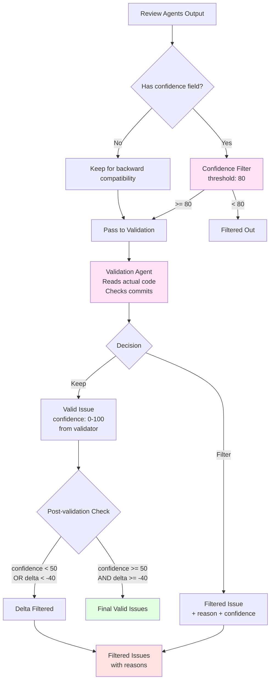
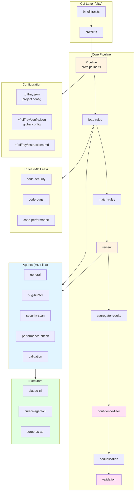
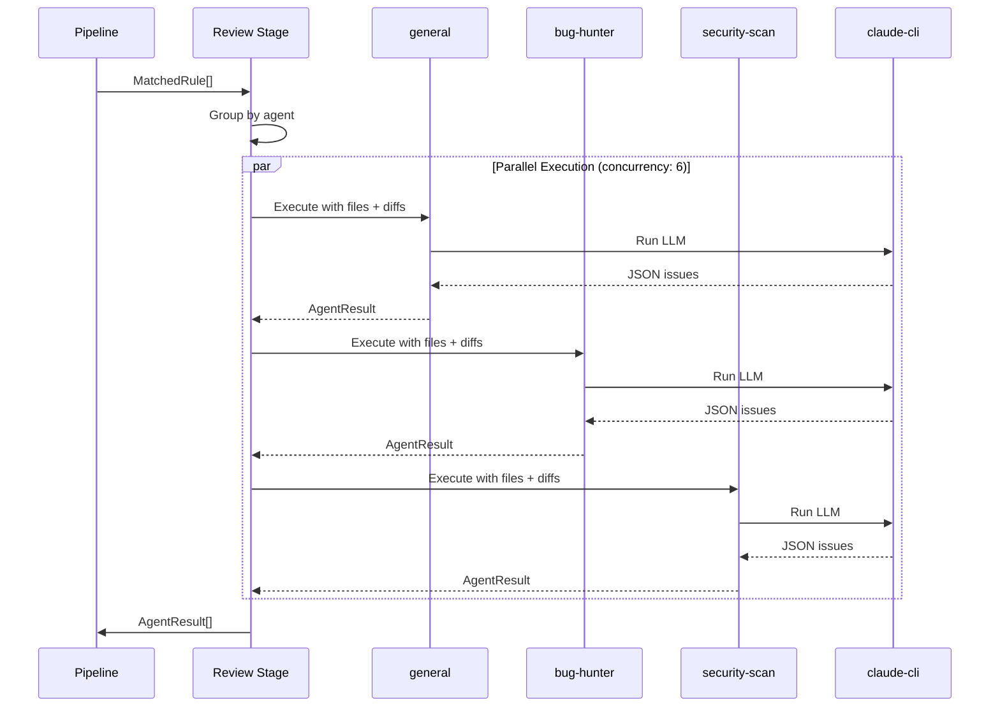
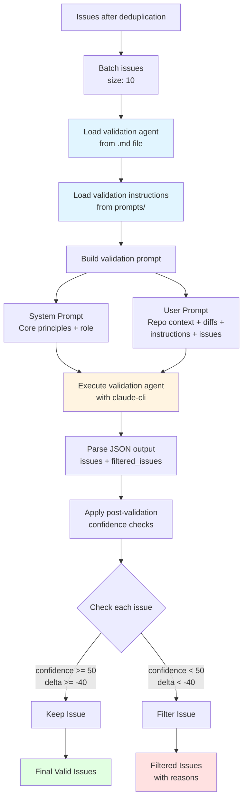

# CLAUDE.md

This file provides guidance to Claude Code (claude.ai/code) when working with code in this repository.

## Project Overview

**diffray** is a free open-source multi-agent code review CLI tool that runs specialized AI agents to review code changes. Each agent focuses on different aspects: bugs, security, performance, code style, consistency.

**Key differences from diffray.ai cloud platform:**
- CLI version requires manual rule configuration but gives full control
- Runs locally with your choice of AI executor (Claude Code, Cursor Agent, Cerebras API)
- Cloud platform automatically learns from team feedback and generates rules

**Prerequisites:**
- Node.js 18+
- Git repository
- AI CLI tool: Claude Code (default), Cursor Agent, or Cerebras API key

## Why diffray?

**Why not just prompts, commands, or skills in Claude Code?**

diffray exists because we believe code review should be **systematic, not ad-hoc**:

- **Distributable rules** — Create, share, and evolve review rules across teams and projects. Rules live in `.diffray/` directories and can be versioned, inherited, and overridden.

- **Flexible configuration** — Fine-tune agents, models, timeouts, and concurrency per project. Disable security checks for a prototype, use Opus for validation, run 6 agents in parallel — all configurable.

- **LLM independence** — Not locked to Claude Code. Use `claude-cli`, `cursor-agent-cli`, Cerebras API, or add your own executor. Switch models per stage (Haiku for fast passes, Opus for validation).

- **Clean context** — Each agent runs in isolation with only relevant diffs and rules. No conversation history pollution, no context window bloat. Parallel execution with fresh context per agent.

- **Performance** — Run multiple specialized agents concurrently. Batch validation. Stream results. Process large PRs that would overwhelm a single LLM session.

- **Reproducibility** — Same rules + same diffs = consistent reviews. No dependency on conversation state or prompt engineering skills.

## Common Commands

### Development
- `npm run dev` - Run CLI in development mode using tsx (`./bin/diffray.ts`)
- `npm test` - Run all tests with Vitest
- `npm test -- md-loader` - Run specific test file
- `npm test:watch` - Run tests in watch mode
- `npm run build` - Build to `dist/diffray.cjs` (esbuild + copy defaults/)
- `npm run ts-check` - TypeScript type checking (tsc --noEmit)
- `npm run lint` - ESLint
- `npm run lint:fix` - Fix lint issues
- `npm run format` - Format with Prettier
- `npm run format:check` - Check formatting without changes

### Linking for Local Testing
- `npm run link:local` - Modifies package.json to use `./bin/diffray.ts` and runs `npm link`
- `npm run link:publish` - Restores package.json to use `./dist/diffray.cjs`
- `npm link` - Link globally using current package.json bin config
- `npm unlink` - Unlink global package

### Publishing
- `npm run prepublishOnly` - Runs automatically before publish (build + link:publish)

### Using diffray CLI
```bash
# Review uncommitted changes, or last commit if clean
diffray review

# Review changes compared to main branch
diffray review --base main

# Review last 3 commits
diffray review --base HEAD~3

# Review specific file(s) - only git changes in these files
diffray review --files src/auth.ts
diffray review --files src/auth.ts,src/user.ts

# Review entire file content (without git diff)
diffray review --files src/auth.ts --full

# Show only critical and high severity issues
diffray review --severity critical,high

# Run only specific agent
diffray review --agent bug-hunter

# Output as JSON (for CI/CD pipelines)
diffray review --json

# Show detailed progress with streaming
diffray review --stream

# List available agents and rules
diffray agents
diffray rules
```

## Architecture Overview

### Pipeline Flow

```mermaid
flowchart LR
    A[Git Diffs] --> B[Pipeline]
    B --> C1[load-rules]
    C1 --> C2[match-rules]
    C2 --> C3[review]
    C3 --> C4[aggregate-results]
    C4 --> C5[confidence-filter]
    C5 --> C6[deduplication]
    C6 --> C7[validation]
    C7 --> D[Issues]

    style C1 fill:#e1f5ff
    style C2 fill:#e1f5ff
    style C3 fill:#fff4e1
    style C4 fill:#e1f5ff
    style C5 fill:#ffe1f5
    style C6 fill:#e1f5ff
    style C7 fill:#ffe1f5

    classDef default stroke:#333,stroke-width:2px
```



**Stages (sequential):**
1. **load-rules** - Load rules from MD files, resolve agents
2. **match-rules** - Match files to rules using glob patterns
3. **review** - Run agents in parallel via executors
4. **aggregate-results** - Collect results from all agents
5. **confidence-filter** - Filter issues below confidence threshold (default: 80)
6. **deduplication** - Remove duplicate issues
7. **validation** - LLM validates issues, returns keep/filter + reason

### Quality Pipeline



**Quality thresholds:**
- **Confidence Filter**: Hard threshold at 80% (configurable via `--confidence`)
- **Validation**: Binary keep/filter decision with reason
- **Post-validation**: confidence >= 50 AND delta >= -40

### Component Architecture



### Core Components

**Entry Point**: `bin/diffray.ts` → `src/cli.ts` (citty CLI framework)

**Pipeline** (`src/pipeline.ts`):
- Orchestrates stages sequentially
- Manages `PipelineContext` passed between stages
- Registers agents and executors

**Stages** (`src/stages/`):
- Each stage implements `Stage` interface with `execute(context)` method
- Stages mutate `PipelineContext` (add matchedRules, results, issues)

**Agents** (`src/defaults/agents/*.md`):
- Defined in Markdown with YAML frontmatter (ID, Order, Enabled, Executor)
- Loaded directly from MD files on each run via `src/agents/md-loader.ts`
- Sources (priority order): project `.diffray/agents/`, user `~/.diffray/agents/`, extends, defaults
- Built-in agents:
  - `general` - General code reviewer focused on simplicity and clarity
  - `bug-hunter` - Detects bugs, logic errors and runtime issues
  - `security-scan` - Scans for security vulnerabilities
  - `performance-check` - Checks for performance issues
  - `consistency-check` - Detects inconsistencies in code style, patterns, and conventions
  - `validation` - Validates issues found by other agents (internal)

**Executors** (`src/executors/`):
- Types: `llm-api` (HTTP API), `cli` (subprocess), `mcp` (MCP protocol)
- Modular structure: `api.ts`, `cli.ts`, `claude-cli.ts`, `cursor-agent-cli.ts`, `process.ts`, `types.ts`, `utils.ts`
- Built-in executors:
  - `cerebras-api` - Cerebras AI API (requires `CEREBRAS_API_KEY`)
  - `claude-cli` - Claude Code CLI with streaming support
  - `cursor-agent-cli` - Cursor Agent CLI
  - `test-cli` - Stub for testing

**Claude CLI Executor**:
- Uses `claude -p --output-format stream-json --verbose` for streaming
- Default: quiet (no streaming output)
- With `--stream` shows:
  - `📋` - Session info (model, tools)
  - `🔧` - Tool use (Read, Grep, etc.)
  - `💭` - Thinking (truncated to 200 chars)
  - `📊` - Cost/duration
  - `⚠ Preliminary issues` - Formatted before validation
- With `--verbose`: raw JSON stream
- Default model: `sonnet`, timeout: 120s

**Rules** (`src/defaults/rules/*.md`):
- Map glob patterns to agents
- Contain additional prompts for matched files
- Loaded directly from MD files on each run via `src/md-loader.ts`
- Sources (priority order): project `.diffray/rules/`, user `~/.diffray/rules/`, extends, defaults

**Creating Custom Rules**:

Create rules in `.diffray/rules/` directory. Example:

```markdown
---
name: input-validation
description: Ensure all input validation uses Zod schemas
patterns:
  - src/**/*.ts
  - bin/**/*.ts
agent: general
---

# Input Validation with Zod

All input validation must use Zod schemas for type safety.

## Rules

### ❌ Avoid:
- Manual `parseInt`, `parseFloat`, `isNaN` checks
- String splitting with manual array validation

### ✅ Use instead:
- Zod `.coerce.number()` for number parsing
- Zod `.refine()` for validation with clear errors
- Centralized schemas in `*-schema.ts` files

## Example

See `src/cli-schema.ts` for reference implementation.

## When to flag

Flag code with manual validation of user input (CLI args, API inputs, config).

## When NOT to flag

Don't flag existing Zod schemas or internal calculations.
```

Rule badges: `◆` defaults, `◉` extends, `◇` user, `●` project

**Extends** (`src/extends/`):
- Load agents/rules from any git repository
- Supports HTTPS (`https://github.com/owner/repo`) and SSH (`git@github.com:owner/repo.git`)
- Optional ref with `#`: `https://github.com/owner/repo#v1.0`
- Cloned to `~/.diffray/extends/`, tracked in `~/.diffray/extends.lock.json`
- Key files: `parser.ts`, `downloader.ts`, `resolver.ts`, `lockfile.ts`, `loader.ts`

### Data Flow

```mermaid
flowchart LR
    A[GitDiff Array] --> B[match-rules stage]
    B --> C[MatchedRule Array<br/>files + agent + prompt]

    C --> D[review stage<br/>parallel execution]
    D --> E[AgentResult Array<br/>raw JSON output]

    E --> F[aggregate-results]
    F --> G[Issue Array<br/>parsed issues]

    G --> H[confidence-filter]
    H --> I[Issue Array<br/>confidence >= 80]

    I --> J[deduplication]
    J --> K[Issue Array<br/>unique issues]

    K --> L[validation]
    L --> M[Issue Array<br/>validated + filtered]

    style C fill:#e1f5ff
    style E fill:#fff4e1
    style G fill:#e1ffe1
    style I fill:#ffe1f5
    style K fill:#e1f5ff
    style M fill:#e1ffe1
```



### Agent Execution (Review Stage)



### Validation Process



**Validation optimizations:**
- System prompt: 57 lines (~1.3KB) - Core principles only
- User prompt: Detailed instructions from `validation-instructions.md`
- Reduces API costs via prompt caching

### Issue Structure
```typescript
interface Issue {
  file: string;
  lineStart: number;
  lineEnd: number;
  severity: 'critical' | 'high' | 'medium' | 'low';
  category: 'security' | 'performance' | 'bug' | 'quality' | 'style' | 'docs';
  shortDescription: string;
  fullDescription: string;
  suggestion?: string;
  agent: string;
  rule?: string;         // Rule(s) that triggered this issue
  evidence?: string;     // Concrete code proof that demonstrates the issue
  confidence?: number;   // Certainty level 0-100 (filtered by --confidence flag)
}
```

## Key Files
- `src/types.ts` - All TypeScript interfaces
- `src/config.ts` - Config schema (Zod), load/save to `~/.diffray/config.json`
- `src/issue-parser.ts` - Parse JSON issues from agent output
- `src/issue-formatter.ts` - Format issues for terminal/JSON output
- `src/concurrency.ts` - p-limit style concurrency limiter
- `src/batch-executor.ts` - Batch execution with spinner feedback
- `src/stages/confidence-filter.ts` - Filter issues by confidence threshold
- `src/defaults/prompts/output-format.md` - JSON format agents must return (includes evidence, confidence)
- `src/defaults/prompts/validation-instructions.md` - Detailed validation instructions (injected in user prompt)

## CLI Subcommands
- `diffray review` - Execute code review pipeline
  - `--base <ref>` - Base commit/branch (e.g., `main`, `HEAD~3`)
  - `--head <ref>` - Head commit/branch (default: `HEAD`)
    - When `--base` specified with no uncommitted changes, temporarily checks out `--head` ref for CLI tools, then restores original branch
  - `--files <list>` - Review only specific files (comma-separated paths)
  - `--full` - Review entire file content without git diff (requires `--files`)
  - `--agent <list>` - Run only specific agents (comma-separated: `bug-hunter,general`)
  - `--exclude-agent <list>` - Exclude specific agents (comma-separated)
  - `--rule <list>` - Run only specific rules (comma-separated: `code-security,code-bugs`)
  - `--exclude-rule <list>` - Exclude specific rules (comma-separated)
  - `--severity <list>` - Filter by severity (comma-separated: critical,high,medium,low)
  - `--confidence <0-100>` - Minimum confidence threshold (default: 80). Issues below are filtered out before validation.
  - `--json` - Output results in JSON format
  - `--stream` - Show streaming (💭 thinking, 🔧 tools, ⚠ preliminary issues)
  - `--verbose` - Show raw JSON stream
  - `--skip-validation` - Skip validation stage
  - Without `--base`: reviews uncommitted changes, or last commit if clean
- `diffray agents` - List agents, `diffray agents <name>` - Show agent details
- `diffray rules` - List rules, `diffray rules <name>` - Show rule details
- `diffray executors` - Show current executor and stage settings
- `diffray executors <name>` - Show executor details (command, model, timeout)
- `diffray config show` - Show merged configuration
- `diffray config init` - Initialize project config (.diffray.json)
- `diffray config edit [--global]` - Edit config in $EDITOR
- `diffray extends install` - Clone extends from config
- `diffray extends install --force` - Force re-clone all extends
- `diffray extends list` - Show installed extends
- `diffray extends remove <git-url>` - Remove an installed extend

## Technology
- Runtime: Node.js 18+ (uses native ES modules)
- CLI Framework: citty
- Type Safety: TypeScript (strict mode, bundler resolution)
- Build: esbuild (via `build.mjs`)
- Testing: Vitest
- Validation: Zod schemas
- Git Operations: diff library + native git commands (`src/git.ts`)

## Configuration

Configuration uses two levels with priority merge:
- **Global**: `~/.diffray/config.json` - user-wide settings
- **Project**: `.diffray.json` - project-specific overrides

Priority: defaults < extends < user (~/.diffray/) < project (.diffray/)

**Config commands:**
```bash
diffray config show              # Show merged config
diffray config init              # Create .diffray.json in project
diffray config edit              # Edit project config in $EDITOR
diffray config edit --global     # Edit global config
```

**Example global config** (`~/.diffray/config.json`):
```json
{
  "extends": ["https://github.com/diffray/diffray-rules"],
  "executor": "claude-cli",
  "concurrency": 6,
  "executors": {
    "claude-cli": {
      "review": { "model": "sonnet", "concurrency": 6 },
      "validation": { "model": "opus", "timeout": 180, "batchSize": 10, "concurrency": 3 }
    }
  },
  "agents": {},
  "rules": {},
  "output": { "colorize": true, "verbose": false, "format": "terminal" }
}
```

**Example project config** (`.diffray.json`):
```json
{
  "agents": {
    "security-scan": { "enabled": false },
    "bug-hunter": { "model": "haiku" }
  },
  "rules": {
    "code-security": { "enabled": false }
  }
}
```

**Agent overrides** (`config.agents.<name>`):
- `enabled` - Enable/disable agent (boolean)
- `model` - Override model for agent
- `timeout` - Override timeout for agent

**Rule overrides** (`config.rules.<name>`):
- `enabled` - Enable/disable rule (boolean)
- `agent` - Override agent for rule

**Stage settings** (`executors.<executor>.<stage>`):
- `model` - Model to use for this stage
- `timeout` - Timeout in seconds
- `concurrency` - Parallel executions (1-10)
- `batchSize` - Items per batch (validation only, 1-50)

**Key settings:**
- `extends` - Git URLs to load agents/rules from (e.g., `["https://github.com/owner/repo#v1.0"]`)
- `executor` - Active executor (`claude-cli`, `cursor-agent-cli`)
- `concurrency` - Default parallel agents (1-10)
- `executors.<name>.<stage>` - Per-executor stage settings
- `agents.<name>` - Agent overrides
- `rules.<name>` - Rule overrides

## Development Notes

### Build System
- **Build tool**: esbuild (configured in `build.mjs`)
- **Output**: Single bundled file `dist/diffray.cjs`
- **Defaults**: `src/defaults/` copied to `dist/defaults/` during build
- **Entry point**: `bin/diffray.ts` (dev) → `dist/diffray.cjs` (production)

### Module System
- **Type**: ES Modules (`"type": "module"` in package.json)
- **TypeScript**: Bundler moduleResolution (no `.js` extensions needed in imports)
- **Runtime**: tsx for development, bundled .cjs for production

### Testing
- **Framework**: Vitest
- **Run**: `npm test` (all tests), `npm test -- <name>` (specific test)
- **Watch mode**: `npm test:watch`

### Code Quality
- **Linting**: ESLint with TypeScript support
- **Formatting**: Prettier
- **Pre-commit**: Husky + lint-staged (auto-format on commit)
- **Type checking**: `tsc --noEmit` (strict mode enabled)

### Key Patterns
- Markdown frontmatter parsed with custom regex (see `src/agents/md-loader.ts`, `src/md-loader.ts`)
- Global instructions can be added at `~/.diffray/instructions.md`
- Agents and rules are always loaded fresh from MD files (no caching except via `src/cache.ts`)
- Agents reference prompts via relative paths like `../prompts/output-format.md`
- Validation prompt split: system prompt (core principles) + user prompt (detailed instructions from `validation-instructions.md`)

### File Structure
- `bin/` - Entry point for development
- `src/` - Source code
  - `stages/` - Pipeline stages (load-rules, match-rules, review, etc.)
  - `executors/` - LLM executors (claude-cli, cursor-agent-cli, cerebras-api)
  - `defaults/` - Built-in agents, rules, prompts
  - `extends/` - Git-based rule inheritance system
- `dist/` - Built artifacts (created by `npm run build`)
- `tests/` - Test files (co-located with source or separate)
